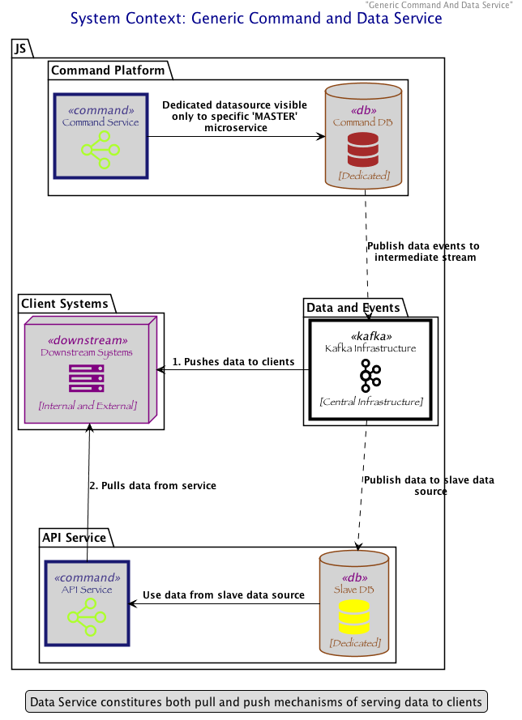

# Building a Product Data Service using event streaming

**Context**
Future Food programme is set-up to replace legacy systems and enable technology services take a leap into future. The programme is designed as a collection of micro-services, with each micro-service taking ownership of a particular domain such as: Product, Pricing, Promotions and Locations

Each micro-service broadly would contain two broad areas:  

* Command Service: Service that masters data and enables Create, Update and Delete functionalities to the master data
* Data Service: A 100% slave service, which publishes data related to domain to the wider enterprise. In a monolith data is tightly coupled and accessible to all domains without restriction. Data Services is the glue through which each of the micro-services will communicate with one another. 

<!-- 

  

 -->

  
 

**What is a Universal Data Service (UDS)?**

* Acts as a 100% re-creatable, 100% re-playable, 100% slave and broker of master data.
* Sources data from multiple data sources, choosing the best data source for the appropriate entity and attribute.
* Acts as a ___long-living repository___ to which multiple consumer can connect to obtain data.
* Abstracts the original data source from the end consumer, enabling the ease of switching to a new data source as systems evolve.
* Provides data interface to consumers in a standardized manner.
* Is not a master of data in itself. Does not take ownership of data; but takes ownership for the availability and resilience of data while serving the data to consumers

**Typical use of Kafka: A ***short-lived*** medium of transmitting transaction events**

* A one time full refresh of data(if required) to target system. Executed by by-passing of the streaming technology such as web-methods
* Subsequently, on-going changes to source system published to Kafka and picked up by the target system
* Usually the validity of these transactions would be short-lived. Hence data is usually retained for only a short period of time

**Disadvantages of transactional Kafka approach when applied to UDS**

* Results in point-to-point integration and Mesh Topology. When UDS attempts to publish data from M data sources to N consumers, this will result in M*N point-to-point interactions. 
* When a consumer upgrades business logic and would like to re-process and re-publish their data, the consumer needs to obtain all the source data that it connects to   has to be republished into the consumer. This would be replicated across multiple consumers when each of that consumer has such a need.
* When a data source changes the schema, changes its connection mechanism or technology, all the consumers in the point-to-point integration, are impacted by the change.
* Obtaining and trusting historical content might often require a full refresh

**Adapting Kafka to enable UDS**

* Design data processing as a Star Topology, with Kafka acting as the central back bone.
* Advertise to consumers schemas rather than data sources. This abstracts the consumer away from data source.
* Do away limitations with respect to retention. Trust Kafka to do the job it is designed for, Kafka is designed to act as a resilient and persistent log of immutable events.
* Enable access to latest version of 100% of records.

**Potential trade-offs and challenges**

* How large is large with respect to the size of the Kafka log? What is the cost to maintaining this largeness?
* What is the cost of implementing this largeness?
* What is the trade-off in cost terms for implementing this largeness against the cost of implementing point-to-point interactions on an on-going basis and when the size of data sources and consumers increase?
* Will adopting point-to-point interaction create a bottleneck for the Data and Events

[command_data_split]: 

 